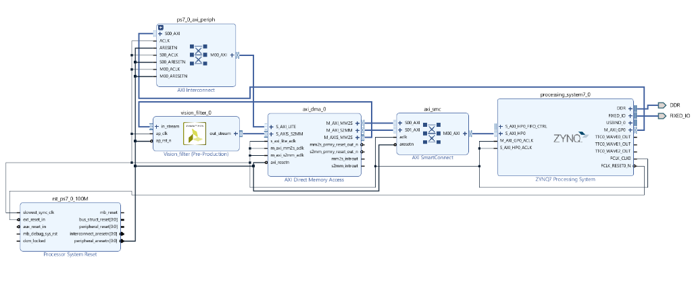

# Sobel Filter on Zynq (MicroZed)

A hardware-accelerated Sobel edge detection pipeline for a webcam stream, built around a
custom Vitis HLS IP core (`vision_filter`) integrated into a Zynq-7010 (MicroZed) block
design in Vivado. A PC-side Python client captures webcam frames, streams them to the
board over TCP, and displays the processed result alongside the original feed.

## Block Design



The design streams AXI4-Stream video frames through the custom `vision_filter` IP via
AXI DMA, using an AXI SmartConnect to arbitrate access to the Zynq PS from the DMA engine
while the AXI Interconnect exposes the DMA's control/status registers to the PS over
`M_AXI_GP0`.

## How it works

1. **`Web_cam_stream/stream.py`** grabs frames from a PC webcam via OpenCV, resizes them
   to 320x240, converts to RGBA, and sends the raw bytes over a TCP socket to the board.
2. The Zynq PS forwards the frame into the PL over AXI DMA as an AXI4-Stream.
3. **`vision_filter_HLS/vision_filter.cpp`** consumes the stream pixel-by-pixel, maintains
   a two-line sliding window buffer, and applies the Sobel Gx/Gy kernels to the green
   channel to compute per-pixel edge magnitude.
4. The edge-detected frame is packed back into RGBA and streamed back through DMA to the
   PS, which returns it to the PC client over the same TCP socket.
5. The PC client displays both the original and the FPGA-processed (edge-detected) frames.

## Repository layout

| Path                  | Description                                                              |
|-----------------------|---------------------------------------------------------------------------|
| `vision_filter_HLS/`  | Vitis HLS project containing the `vision_filter` C++ IP core source.      |
| `Vivado_Project/`     | Vivado project with the Zynq block design that integrates the HLS IP.     |
| `Web_cam_stream/`     | Python client that streams webcam frames to/from the board over TCP.      |
| `docs/images/`        | Documentation assets (e.g. block design diagram).                         |

## Hardware target

- **FPGA:** Xilinx Zynq-7010 (`xc7z010clg400-1`) — MicroZed
- **Video format:** 320x240 RGBA frames, AXI4-Stream

## Getting started

### 1. Build the HLS IP

Open `vision_filter_HLS` in Vitis HLS (or Vivado HLS), run C synthesis, and export the
RTL as an IP core.

### 2. Build the bitstream

Open `Vivado_Project/vision_filter.xpr` in Vivado, ensure the exported `vision_filter` IP
is available in the IP catalog, run synthesis/implementation, and generate the bitstream.
Boot the MicroZed with the resulting bitstream/hardware handoff.

### 3. Stream video from the PC

Update `ZYNQ_IP` in `Web_cam_stream/stream.py` to match the board's IP address, then run:

```bash
pip install opencv-python numpy
python Web_cam_stream/stream.py
```

This opens two windows: the raw webcam feed and the Sobel edge-detected output produced
by the FPGA.
